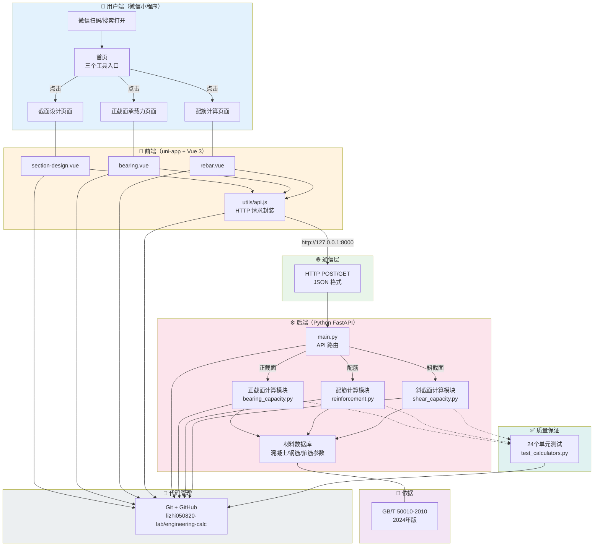
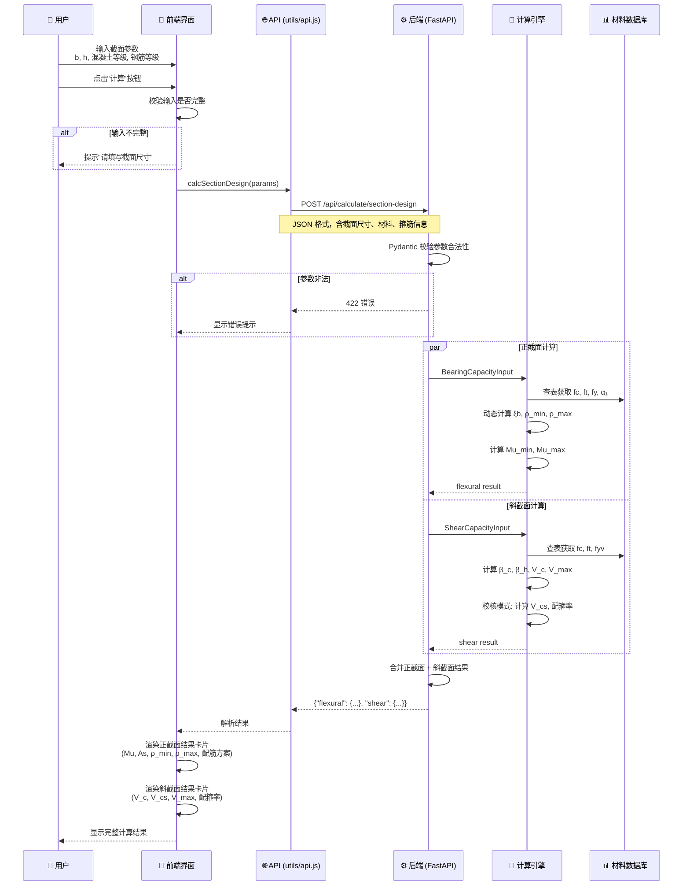
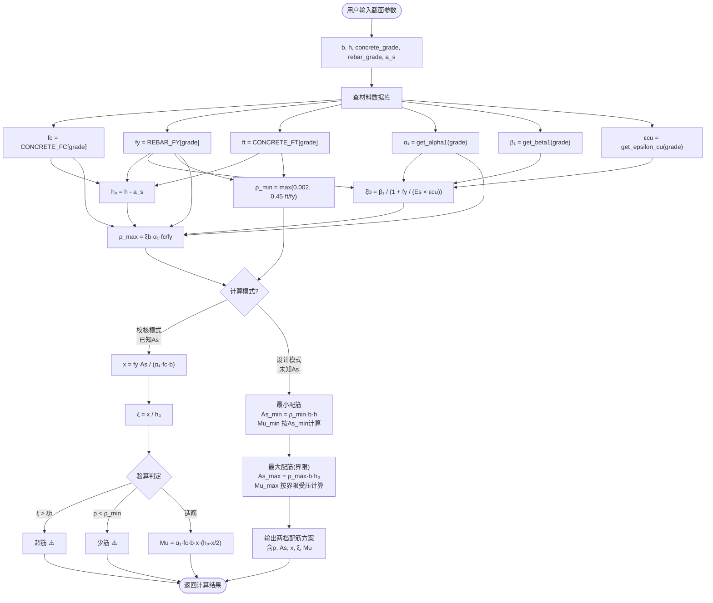
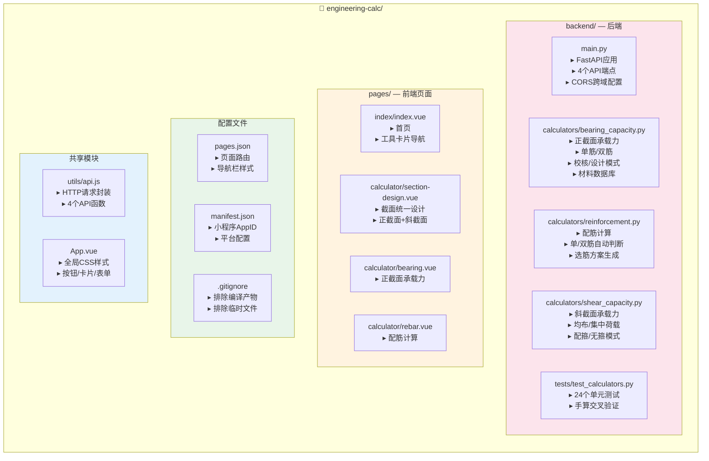
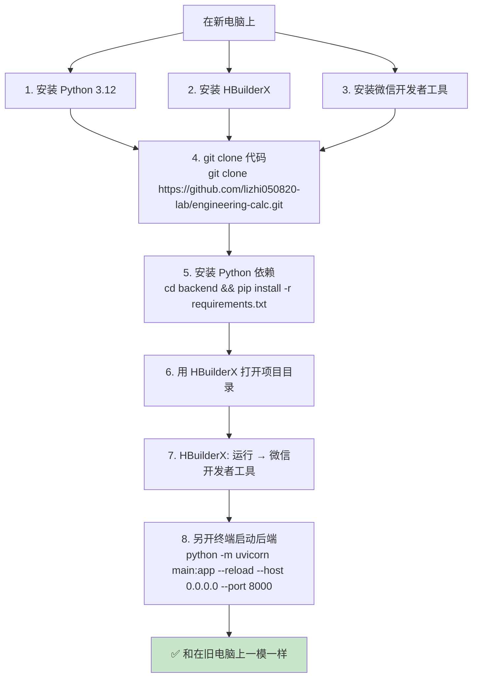

# 土木工程计算工具箱 — 完整流程图

## 1. 项目整体架构

```mermaid
flowchart TB
    subgraph 用户端["📱 用户端（微信小程序）"]
        A[微信扫码/搜索打开]
        B[首页<br/>三个工具入口]
        C1[截面设计页面]
        C2[正截面承载力页面]
        C3[配筋计算页面]
    end

    subgraph 前端["🎨 前端（uni-app + Vue 3）"]
        D1[section-design.vue]
        D2[bearing.vue]
        D3[rebar.vue]
        E[utils/api.js<br/>HTTP 请求封装]
    end

    subgraph 通信["🌐 通信层"]
        F[HTTP POST/GET<br/>JSON 格式]
    end

    subgraph 后端["⚙️ 后端（Python FastAPI）"]
        G[main.py<br/>API 路由]
        H1[正截面计算模块<br/>bearing_capacity.py]
        H2[配筋计算模块<br/>reinforcement.py]
        H3[斜截面计算模块<br/>shear_capacity.py]
        I[材料数据库<br/>混凝土/钢筋/箍筋参数]
    end

    subgraph 规范["📐 依据"]
        J[GB/T 50010-2010<br/>2024年版]
    end

    subgraph 测试["✅ 质量保证"]
        K[24个单元测试<br/>test_calculators.py]
    end

    subgraph 存储["💾 代码管理"]
        L[Git + GitHub<br/>lizhi050820-lab/engineering-calc]
    end

    A --> B
    B -->|点击| C1
    B -->|点击| C2
    B -->|点击| C3
    C1 --- D1
    C2 --- D2
    C3 --- D3
    D1 & D2 & D3 --> E
    E -->|"http://127.0.0.1:8000"| F
    F --> G
    G -->|正截面| H1
    G -->|配筋| H2
    G -->|斜截面| H3
    H1 & H2 & H3 --> I
    I --- J
    H1 & H2 & H3 -.-> K
    D1 & D2 & D3 & E & G & H1 & H2 & H3 & K --> L

    style 用户端 fill:#E3F2FD
    style 前端 fill:#FFF3E0
    style 通信 fill:#E8F5E9
    style 后端 fill:#FCE4EC
    style 规范 fill:#F3E5F5
    style 测试 fill:#E0F2F1
    style 存储 fill:#ECEFF1
```

---

## 2. 开发全过程（时间线）

```mermaid
flowchart LR
    subgraph S1["🔧 环境准备"]
        A1[安装 Python 3.12]
        A2[安装 HBuilderX]
        A3[安装微信开发者工具]
        A4[注册微信小程序<br/>获得 AppID]
    end

    subgraph S2["🏗️ 搭建项目"]
        B1[创建 uni-app 项目]
        B2[配置 pages.json 路由]
        B3[配置 manifest.json<br/>填入 AppID]
        B4[写 App.vue 全局样式]
    end

    subgraph S3["⚙️ 后端开发"]
        C1[创建 FastAPI 应用<br/>main.py]
        C2[正截面承载力<br/>bearing_capacity.py]
        C3[配筋计算<br/>reinforcement.py]
        C4[斜截面承载力<br/>shear_capacity.py]
        C5[材料数据库]
        C6[4个API端点]
    end

    subgraph S4["🐛 发现并修复Bug"]
        D1["α₁系数错误<br/>C80: 0.88→0.94"]
        D2["ξb硬编码<br/>改为动态计算"]
        D3["最小配筋率<br/>h₀→h"]
        D4["双筋设计回退<br/>单筋→双筋逻辑"]
        D5["/api/references<br/>硬编码→导入模块"]
    end

    subgraph S5["🎨 前端开发"]
        E1[首页 index.vue]
        E2[正截面页面 bearing.vue]
        E3[配筋页面 rebar.vue]
        E4[截面设计页面<br/>section-design.vue]
        E5[API通信 utils/api.js]
    end

    subgraph S6["🧪 测试"]
        F1[写24个单元测试]
        F2[教材算例交叉验证]
        F3[高强混凝土验证]
    end

    subgraph S7["🚀 发布"]
        G1[Git初始化]
        G2[创建 GitHub 仓库]
        G3[推送源代码]
        G4[写 README 文档]
    end

    S1 --> S2 --> S3 --> S4 --> S5 --> S6 --> S7

    style S4 fill:#FFCDD2
```

---

## 3. 用户点击"计算"后发生了什么

```mermaid
sequenceDiagram
    participant U as 👤 用户
    participant F as 🎨 前端界面
    participant A as 🌐 API (utils/api.js)
    participant B as ⚙️ 后端 (FastAPI)
    participant C as 🧮 计算引擎
    participant D as 📊 材料数据库

    U->>F: 输入截面参数<br/>b, h, 混凝土等级, 钢筋等级
    U->>F: 点击"计算"按钮

    F->>F: 校验输入是否完整
    alt 输入不完整
        F-->>U: 提示"请填写截面尺寸"
    end

    F->>A: calcSectionDesign(params)
    A->>B: POST /api/calculate/section-design
    Note over A,B: JSON 格式，含截面尺寸、材料、箍筋信息

    B->>B: Pydantic 校验参数合法性
    alt 参数非法
        B-->>A: 422 错误
        A-->>F: 显示错误提示
    end

    par 正截面计算
        B->>C: BearingCapacityInput
        C->>D: 查表获取 fc, ft, fy, α₁
        C->>C: 动态计算 ξb, ρ_min, ρ_max
        C->>C: 计算 Mu_min, Mu_max
        C-->>B: flexural result
    and 斜截面计算
        B->>C: ShearCapacityInput
        C->>D: 查表获取 fc, ft, fyv
        C->>C: 计算 β_c, β_h, V_c, V_max
        C->>C: 校核模式: 计算 V_cs, 配箍率
        C-->>B: shear result
    end

    B->>B: 合并正截面 + 斜截面结果
    B-->>A: {"flexural": {...}, "shear": {...}}
    A-->>F: 解析结果

    F->>F: 渲染正截面结果卡片<br/>(Mu, As, ρ_min, ρ_max, 配筋方案)
    F->>F: 渲染斜截面结果卡片<br/>(V_c, V_cs, V_max, 配箍率)
    F-->>U: 显示完整计算结果
```

---

## 4. 计算引擎内部逻辑（正截面承载力为例）

```mermaid
flowchart TD
    START([用户输入截面参数]) --> INPUT[b, h, concrete_grade, rebar_grade, a_s]

    INPUT --> LOOKUP[查材料数据库]
    LOOKUP --> FC["fc = CONCRETE_FC[grade]"]
    LOOKUP --> FY["fy = REBAR_FY[grade]"]
    LOOKUP --> FT["ft = CONCRETE_FT[grade]"]
    LOOKUP --> A1["α₁ = get_alpha1(grade)"]
    LOOKUP --> B1["β₁ = get_beta1(grade)"]
    LOOKUP --> EC["εcu = get_epsilon_cu(grade)"]

    FC & FY & FT --> H0["h₀ = h - a_s"]
    A1 & B1 & FY & EC --> XIB["ξb = β₁ / (1 + fy / (Es × εcu))"]
    FT & FY --> RHOMIN["ρ_min = max(0.002, 0.45·ft/fy)"]

    H0 & XIB & A1 & FC & FY --> RHOMAX["ρ_max = ξb·α₁·fc/fy"]

    RHOMIN & RHOMAX --> MODE{计算模式?}

    MODE -->|校核模式<br/>已知As| CHECK["x = fy·As / (α₁·fc·b)"]
    CHECK --> CHECKXI["ξ = x / h₀"]
    CHECKXI --> VERIFY{验算判定}
    VERIFY -->|"ξ > ξb"| OVER["超筋 ⚠️"]
    VERIFY -->|"ρ < ρ_min"| UNDER["少筋 ⚠️"]
    VERIFY -->|"适筋"| OK["Mu = α₁·fc·b·x·(h₀-x/2)"]

    MODE -->|设计模式<br/>未知As| DESIGN_MIN["最小配筋<br/>As_min = ρ_min·b·h<br/>Mu_min 按As_min计算"]
    DESIGN_MIN --> DESIGN_MAX["最大配筋(界限)<br/>As_max = ρ_max·b·h₀<br/>Mu_max 按界限受压计算"]
    DESIGN_MAX --> OUTPUT_DESIGN["输出两档配筋方案<br/>含ρ, As, x, ξ, Mu"]

    OVER & UNDER & OK & OUTPUT_DESIGN --> RESULT([返回计算结果])
```

---

## 5. 文件结构与职责

```mermaid
flowchart LR
    subgraph ROOT["📁 engineering-calc/"]
        direction TB
        subgraph BACKEND["backend/ — 后端"]
            MAIN["main.py<br/>▸ FastAPI应用<br/>▸ 4个API端点<br/>▸ CORS跨域配置"]
            BEARING["calculators/bearing_capacity.py<br/>▸ 正截面承载力<br/>▸ 单筋/双筋<br/>▸ 校核/设计模式<br/>▸ 材料数据库"]
            REBAR["calculators/reinforcement.py<br/>▸ 配筋计算<br/>▸ 单/双筋自动判断<br/>▸ 选筋方案生成"]
            SHEAR["calculators/shear_capacity.py<br/>▸ 斜截面承载力<br/>▸ 均布/集中荷载<br/>▸ 配箍/无箍模式"]
            TESTS["tests/test_calculators.py<br/>▸ 24个单元测试<br/>▸ 手算交叉验证"]
        end

        subgraph FRONTEND["pages/ — 前端页面"]
            INDEX["index/index.vue<br/>▸ 首页<br/>▸ 工具卡片导航"]
            SD["calculator/section-design.vue<br/>▸ 截面统一设计<br/>▸ 正截面+斜截面"]
            BC["calculator/bearing.vue<br/>▸ 正截面承载力"]
            RC["calculator/rebar.vue<br/>▸ 配筋计算"]
        end

        subgraph CONFIG["配置文件"]
            PJ["pages.json<br/>▸ 页面路由<br/>▸ 导航栏样式"]
            MJ["manifest.json<br/>▸ 小程序AppID<br/>▸ 平台配置"]
            GI[".gitignore<br/>▸ 排除编译产物<br/>▸ 排除临时文件"]
        end

        subgraph SHARED["共享模块"]
            API["utils/api.js<br/>▸ HTTP请求封装<br/>▸ 4个API函数"]
            AV["App.vue<br/>▸ 全局CSS样式<br/>▸ 按钮/卡片/表单"]
        end
    end

    style BACKEND fill:#FCE4EC
    style FRONTEND fill:#FFF3E0
    style CONFIG fill:#E8F5E9
    style SHARED fill:#E3F2FD
```

---

## 6. 如果你换电脑，怎么接着开发

```mermaid
flowchart TD
    A["在新电脑上"] --> B["1. 安装 Python 3.12"]
    A --> C["2. 安装 HBuilderX"]
    A --> D["3. 安装微信开发者工具"]
    
    B & C & D --> E["4. git clone 代码<br/>git clone https://github.com/lizhi050820-lab/engineering-calc.git"]
    
    E --> F["5. 安装 Python 依赖<br/>cd backend && pip install -r requirements.txt"]
    
    F --> G["6. 用 HBuilderX 打开项目目录"]
    
    G --> H["7. HBuilderX: 运行 → 微信开发者工具"]
    
    H --> I["8. 另开终端启动后端<br/>python -m uvicorn main:app --reload --host 0.0.0.0 --port 8000"]
    
    I --> J["✅ 和在旧电脑上一模一样"]
    
    style J fill:#C8E6C9
```
